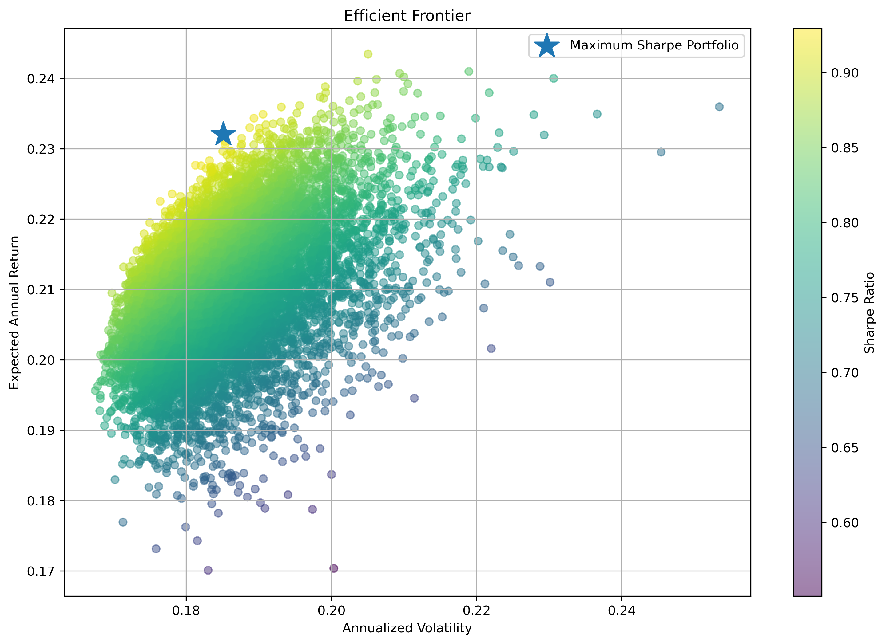
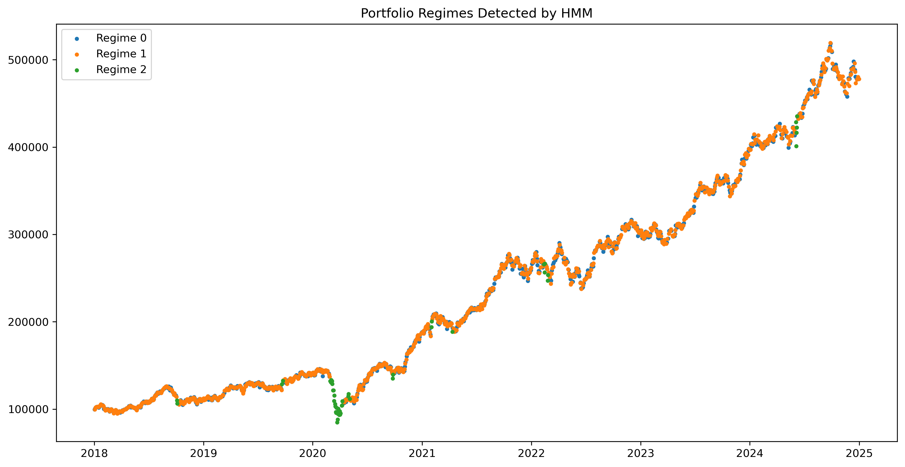
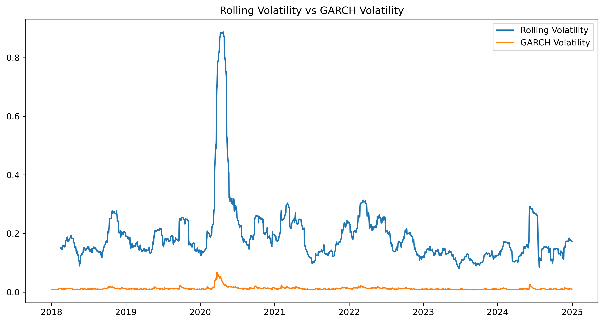
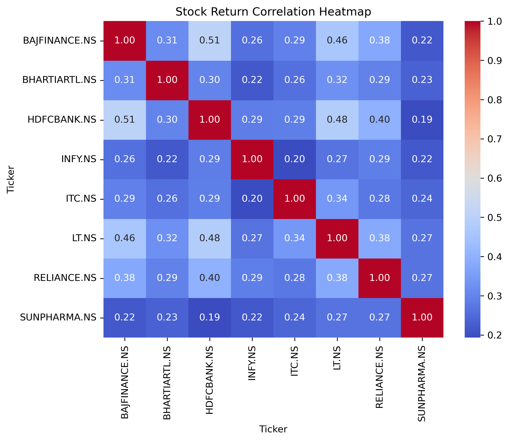
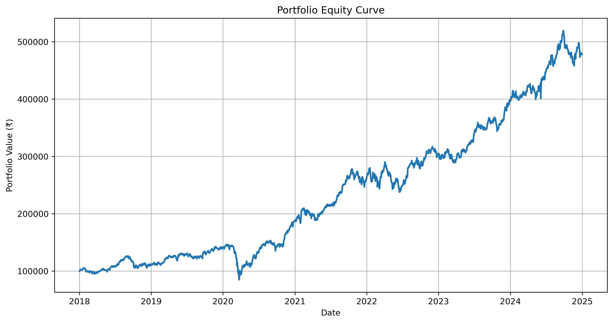
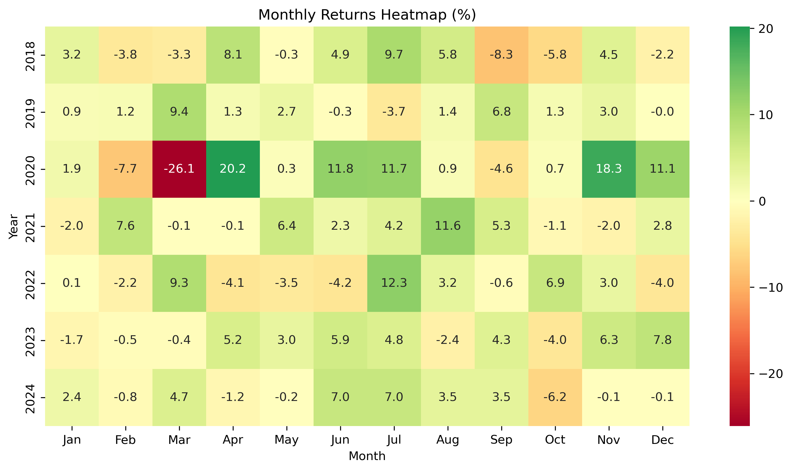

# Quantitative Portfolio Analytics and Risk Management Framework

# Project Overview
This project develops an end-to-end quantitative portfolio analytics and risk management framework using Python.
The framework integrates portfolio construction, risk analytics, volatility modelling, regime detection, and portfolio optimization into a single research workflow.
The analysis was conducted on a diversified portfolio consisting of:

Reliance Industries
HDFC Bank
Infosys
Sun Pharma
Larsen & Toubro
ITC
Bharti Airtel
Bajaj Finance

# Methodology

Portfolio Construction
The following portfolio construction approaches were implemented and compared:
Equal Weight Portfolio
Minimum Variance Portfolio
Risk Parity Portfolio
Maximum Sharpe Portfolio

# Risk Analytics

Performance and risk were evaluated using:
CAGR
Volatility
Sharpe Ratio
Sortino Ratio
Calmar Ratio
Maximum Drawdown
Value at Risk (VaR)
Conditional Value at Risk (CVaR)

# Volatility Modelling

To study changing market risk over time:
Rolling Volatility
Rolling Sharpe Ratio
GARCH(1,1) Conditional Volatility
Volatility Forecasting

# Regime Detection

Market behaviour was analyzed using:
Hidden Markov Models (HMM)
Market Regime Classification
Regime Statistics

# Portfolio Optimization

Portfolio allocations were optimized using:
Monte Carlo Portfolio Simulation
Efficient Frontier Analysis
Maximum Sharpe Portfolio Optimization

# Key Results

Metric        Value
CAGR          25.75%
Volatility    21.53%
Sharpe Ratio  1.17
Sortino Ratio 1.08
Calmar Ratio  0.61
Maximum Drawdown -42.01%

# Key Findings
Portfolio Construction Matters
The Minimum Variance Portfolio significantly reduced portfolio volatility and drawdown compared to the Equal Weight Portfolio, demonstrating that allocation decisions alone can materially alter portfolio risk.

# Volatility Is Not Constant
Rolling volatility and GARCH analysis showed clear evidence of volatility clustering, indicating that periods of high volatility tend to persist rather than occur randomly.

# Market Regimes Exist
Hidden Markov Models identified three distinct market regimes, including a relatively rare stress regime. This suggests that market behaviour changes over time and cannot be treated as a single stationary process.

# Risk-Adjusted Optimization Alters Allocation
The Maximum Sharpe Portfolio concentrated allocations toward assets that historically provided stronger risk-adjusted returns, highlighting the trade-off between diversification and optimization.

# Risk and Return Must Be Evaluated Together
Portfolios with similar returns can exhibit substantially different volatility and drawdown characteristics. Risk-adjusted metrics provided a more complete evaluation than return alone.

# Visual Analytics

# Efficient Frontier

# HMM Regime Detection

# Rolling Volatility vs GARCH

# Correlation Analysis

# Portfolio Equity Curve

# Monthly Returns Heatmap

# Technology Stack
Python
Pandas
NumPy
SciPy
Matplotlib
ARCH
HMMlearn
yFinance
Jupyter Notebook

# Future Research
Potential extensions include:
Regime-Aware Portfolio Allocation
Factor Investing Strategies
Dynamic Asset Allocation
Multi-Asset Portfolio Construction
Statistical Arbitrage Frameworks
Live Market Data Integration
